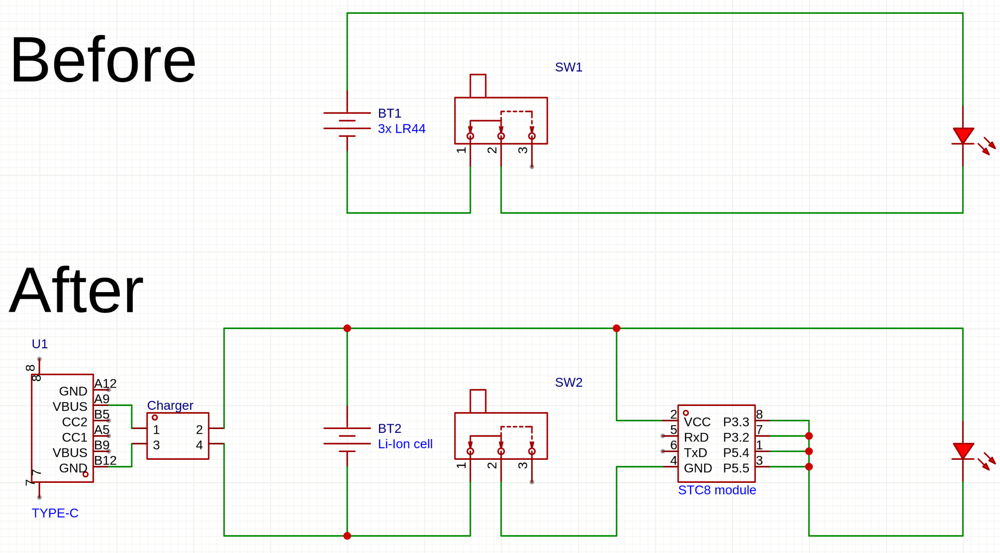
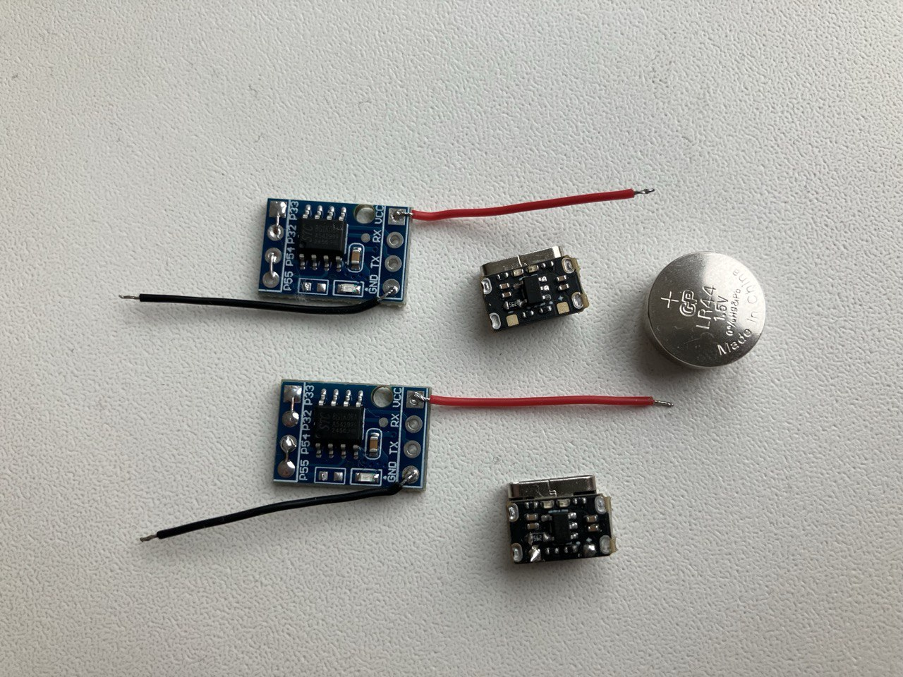
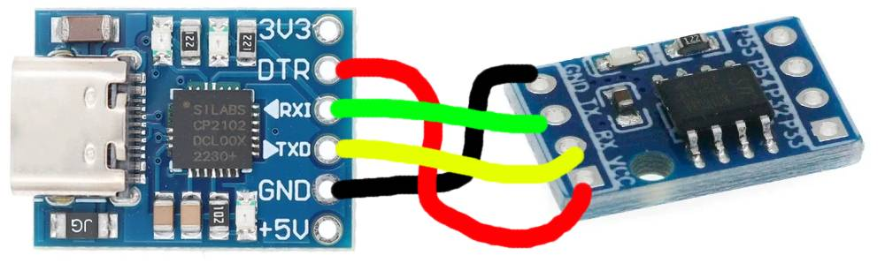

E-Candle simple battery care board
==================

<div class="grid" markdown>


</div>

The project
------------------

A friend of mine has few electronic candles originally powered by
3x LR44 button cells. These batteries typically have 120 mAh capacity,
and the candle consumes about 20 mA (peak 24 mA) (for light and "flame" movement).
So, 3 candles with "burn" 9 cells in 6 hours, 1.5 cell per hour,
and she stockpiled those batteries.  

As I like to solder stuff, I suggested replacing those button cells with
a rechargeable Li-Ion battery. 103030 cell has 900 mAh capacity which means
about 40 hours of light on one charge. I used tiny charging circuits based
on LP4054 chip. Those got very hot on 600 mA, so I replaced a current limiting resistor
to make them charge at 180 mA and stay just warm.

The next thing to do is to protect the li-ion battery.
It already has a built-in protection circuit, but I beleive it has a very low
under-voltage threshold, so additional protection should keep the battery more safe.

Also if you forget the candle on with button cells, the batteries die in 6 hours,
then you replace them with new ones, and it's ready to shine again.
If you forget the candle on with li-ion battery, you need some time to charge,
not too convenient. So, some timer is needed to shut down the candle after
few hours after power on.

Here comes STC8G1K08A board. Small (11x16 mm) and cheap ($0.5) thing
capable of 0.4 uA current consumption in power down mode.
It can provide 20 mA per pin, which is not enough, but 4 pins in parallel
should be OK.



Hardware assembly
------------------

These boards have a LED wired to VCC, so I desoldered it to achieve the low shutdown current.

So, here are electronic components (li-ion batteries not included):


The battery compartment lid has a cut for a pull-off transportation label. I expanded it
to fit USB-C connector of a charger board. The charger board itself is secured _somehow_ inside
by a hot glue and some pieces of plastic (I used USB-A connectors as a source of plastic here).

A Li-Ion battery and STC8 module are held inside by an adhesive tape or more hot glue.
<div class="grid" markdown>


</div>

STC8 stuff
------------------
STC8 is a family of 8051 MCUs made in China. They are surprisingly well documented
(see [Datasheet](https://www.stcmicro.com/datasheet/STC8G-en.pdf) or [copy](res/STC8G-en.pdf)).
Unfortunately, datasheet lies in some aspects:
  * at `0x1ff5..0x1ff6` in flash there are just `FF` empty bytes instead of wakeup timer frequency
  * same for internal reference voltage at `0x1ff7..0x1ff8`
  * wakeup timer runs at about 26.8 kHz instead of documented 32.768 kHz or 36.2 kHz reported by STC-ISP tool

It's convenient to use DTR as a target's VCC. The power is enough, and programming tools can reset the MCU
by triggering DTR pin, so no button required to flash a new firmware. Vendor's STC-ISP tool is much harder to use.



Software tools I ended up with:
  * [SDCC](https://sdcc.sourceforge.net/) 4.5.0 as a C compiler (just from distro)
  * [stcgal](https://github.com/grigorig/stcgal) 1.10 as a flashing tool
  * [a51](https://github.com/tmikov/a51) as an assembler for examples from the datasheet
  * [demos](https://github.com/treideme/STC8H1k08-demos) as a hello world to start with

Building
------------------
To just build the firmware `.hex`, make sure you have `sdcc` in PATH, then call `make` in `src` dir:
```text
$ make -C src
make: Entering directory '/home/stolen/soft/ecandle/ecandle/src'
sdcc -mmcs51 --Werror --std-c2x --out-fmt-ihx --opt-code-size --fomit-frame-pointer candle.c -o candle.hex
make: Leaving directory '/home/stolen/soft/ecandle/ecandle/src'

$ ls src/candle.hex 
src/candle.hex
```

To flash (download) it to an MCU connected via USB-UART, you can use `make flash` in the same `src` dir.  
On first run that will install `stcgal`:
```text
$ make -C src flash
make: Entering directory '/home/stolen/soft/ecandle/ecandle/src'
python3 -m venv .venv
bash -c ". .venv/bin/activate && pip install stcgal"
Collecting stcgal
  Using cached stcgal-1.10-py3-none-any.whl.metadata (1.8 kB)
        ...     ...     ...
.venv/bin/stcgal -a candle.hex -t 24000
Cycling power: done
Waiting for MCU: done
Protocol detected: stc8g
Target model:
  Name: STC8G1K08A-8PIN
  Magic: F794
  Code flash: 8.0 KB
  EEPROM flash: 4.0 KB
        ...     ...     ...
Loading flash: 651 bytes (Intel HEX)
Target frequency: Target 24.000 MHz
Adjusted frequency: 24.002 MHz(0.010%)
Switching to 115200 baud: done
Erasing flash: done
Writing flash: 1088 Bytes [00:00, 6055.95 Bytes/s]                                                                                           
Finishing write: done
Setting options: done
Target UID: F794C4E92308FC
Disconnected!
make: Leaving directory '/home/stolen/soft/ecandle/ecandle/src'
```

Licensing information
-------------------
  * `src/stc8h.h` (borrowed from [STC8H1k08-demos](https://github.com/treideme/STC8H1k08-demos) repo) is licensed under Apache 2.0 license
  * `res/STC8G-en.pdf` is downloaded from [vendor's site](https://www.stcmicro.com/sjsc.html) and I don't know how it's licensed
  * everything else (`src/candle.c`, `src/Makefile`, `res/*.jpg`) is licensed under MIT license.
